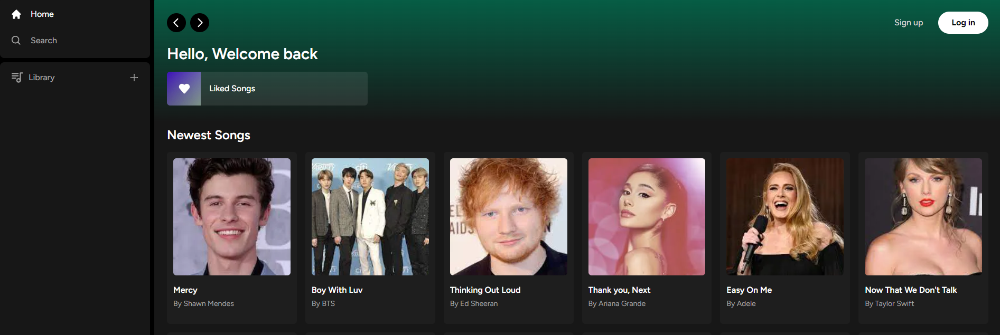

## Project

This project is a spotify clone. Users will be able to sign up and add their own songs to their playlist. Users can also find and add songs from a list of every other user's songs. Welcome aboard and have a great time listening to music!

## Demo

<a href="">
  
</a>

## Getting Started

Runing the server:

```bash
npm run dev
```

## Dependencies

Run the following command to install dependencies.

```sh
npm install
```